# 6장 키-값 저장소 설계

* 키-값 저장소는 키- 데이터베이스라고 불리는 비 관계형 데이터베이스
* 저장소에 저장되는 값은 고유 식별자를 키로 가져야 한다.
* 키와 값 사이의 이런 연결관계를 "키-값 쌍"이라고 부른다.

| 키   | 값     |
|-----|-------|
| 145 | john  |
| 147 | bob   |
| 160 | julia |

* put(key, value): 키-값 쌍을 저장소에 추가
* get(key): 키에 해당하는 값을 반환

## 문제 이해 및 설계 범위 확정

* 키-값 쌍의 크기는 10KB 이하
* 큰 데이터를 저장할 수 있어야 한다.
* 높은 가용성을 제공해야 한다. 따라서 시스템은 설사 장애가 있더라도 빨리 응답 해야한다.
* 높은 규모 확장성을 제공해야 한다. 따라서 트래픽 양에 따라 자동적으로 서버 증성/삭제가 이루어져야 한다.
* 데이터 일관성 수준은 조정이 가능 해야한다.
* 응답 지연시시간이 짧아야 한다.

## 단일 서버-키 값저장소

* 한 대 서바만을 사용 하는 키-값 저장소
* 가장 직관 적이며, 키-값 쌍 전부를 메모리에 해시 테이블로 저장
* 접근은 빠른 속도를 보장하긴 하지만 모든 데이터를 메모리 안에 두는 것이 불가능할 수 있다는 약점
* 이를 개선하기 위한 방법
    * 데이터 압축
    * 자주 쓰이는 데이터만 메모리에 두고 나머지는 디스크에 저장
* 그러나 이 방법으로도 한계가 있다. 한 대 서버로 부족한 경우이다.

## 분산 키-값 저장소

### CAP 정리

* 분산 시스템은 CAP 정리에 따라 세 가지 속성 중 두 가지만 보장할 수 있다.
    * 일관성(Consistency): 분산 시스템에 접속하는 모든 클라이언트는 어떤 노드에 접속하든지 관계없이 언제나 같은 데이터를 보게 되어야 한다.
    * 가용성(Availability): 분산 시스템에 접속한 클라이언트는 일부 노드에 장애가 발생하더라도 항상 응답을 받을 수 있어야 한다.
* 파티션 내구성(Partition Tolerance): 파티션은 두 노드 사이에 통신 장애가 발생하였음을 의미한다. 파티션 감내는 네트워크에 파티션이 생기더라도 시스템은 계속 동작하어야 한다는 뜻한다.

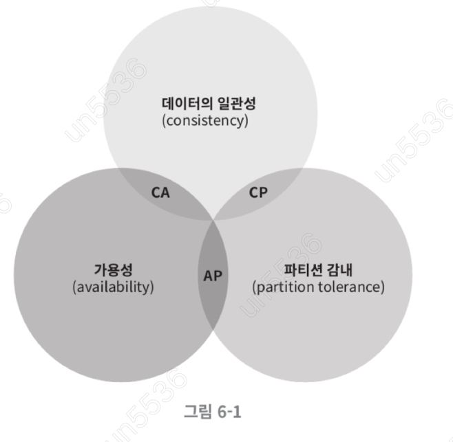

* 이들 가운데 어떤 두 가지를 충족하려면 나머지 하나는 반드시 희생되야 한다는 것을 의미한다.
* CP 시스템: 일관성과 파티션 감내를 지원하는 키-값 저장소, 가용성을 희생한다.
* AP 시스템: 가용성과 파티션 감내를 지원하는 키-값 저장소, 데이터 일관성을 희생한다.
* CA 시스템: 일관성과 가용성을 지원하는 키-값 저장소. 파티션 감내는 지원 하지 않는다. 그러나 통상 네트워크 장애는 피할 수 없는 일로 여겨지므로, 분산 시스템은 반드시 파티션 문제를 감내할수 있도록 설계되야 한다. 그러므로 실세계에는 CA 시스템은 존재하지 않는다.

### 이상적 상태

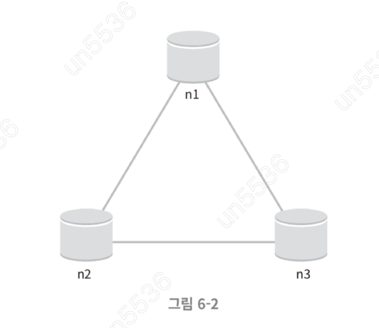

이상적 환경이라면 네트워크가 파티션되는 상황은 절대 일어나지 않을 것이다. n1에 기록된 데이터는 자동적으로 n2와 n3에 복제된다. 데이터 일관성과 가용성도 만족한다.

> 네트워크 파티션
> 
> 네트워크 파티션이 발생한다는 것은, 분산 시스템을 구성하는 여러 노드들 사이의 네트워크 연결에 문제가 생겨서 일부 노드들끼리는 서로 통신할 수 없게 되는 상황을 의미합니다.

### 실셰계의 분산 시스템

* 분산 시스템은 파티션 문제를 피할 수 없다.
* 파티션 문제가 발새앟면 일관성과 가용성 사이에서 하나를 택 해야한다.

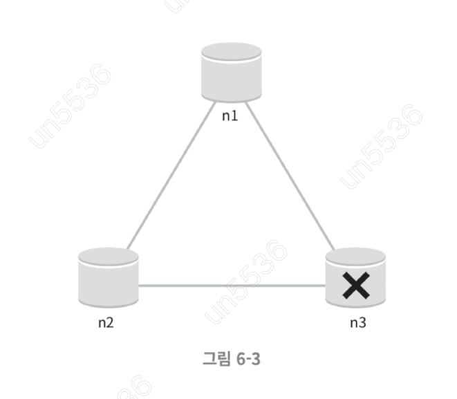

* n3에 장애가 발생하면 n1, n2와 통신할 수 없는 상황
* 클라이언트가 n1 or n2에 기록한 데이터는 n3에 전달 되지 않는다.
* n3에 기록되었으나 아직 n1, n2에 전달되지 않은 데이터가 있다면 n1, n2는 오래된 사본을 갖는다.
* 가용성 대신 일관성을 택핸다면 CP 시스템이 된다.
  * 세 서버 사이에 생길 수 있는 데이터 불일치 문제를 피하기 위해 n1, n2에 대한 쓰기 연산을 중단시켜야 하는데, 이렇게 하면 가용성이 꺠진다.
* 하지만 가용성을 택한다면 AP 시스템이 된다.
  * 일관성 대신 가용성을 선택한 시스템은 낡은 데이터를 반환할 위험이 있더라도 계속 일기 연산을 허용해야 한다. 아울러 n1, n2는 계속 쓰기 연산을 허용할 것이고, 파티션 문제가 해결된 뒤 새 데이터를 n3에 전송할 것이다.

## 시스템 컴포넌트

* 데이터 파티션
* 데이터 다중화
* 일관성
* 일관성 불일치 해소
* 장애 처리
* 시스템 아키텍처 다이어그램
* 쓰기 경로
* 읽기 경로

### 데이터 파티션

* 대규모 애플리케이션의 경우 전체 데이터를 한 대 서버에 저장하는 것은 불가능
* 가장 단순한 해결책은 데이터를 작은 파티션들로 분할한 다음 여러 대 서버에 저장하는 것
* 데이터 파티션을 나눌 때 중요한 두 가지 문제
  * 데이터를 여러 서버에 고르게 분산할 수 있는가
  * 노드가 추가되거나 삭제될 때 데이터 이동을 최소화할 수 있는가.
* 이러한 문제를 해결 하기 위해 안정 해시가 적잡한 기술

### 데이터 다중화

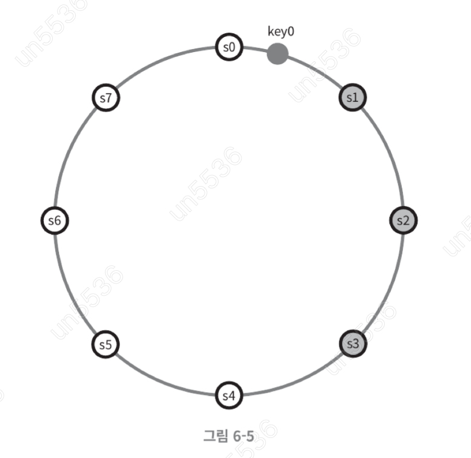

* 높은 가용성과 안전성을 확보하기 위해서는 데이터를 N개 서버에 비동기적으로 다중화를 해야 한다.
* 어떤 키를 해시 링위에 배치한 후 그 지점으로 부터 시계 방향으로 링을 순화하면서 만나는 첫 N개 서버에 데이터 사본을 보관하는 것이다.
* 하지만 같은 데이터 센터에 속한 노드는 정전, 네트워크 이슈, 자연재해 등의 문제를 동시에 껵을 가능성이 있다. 따라서 안전성을 담보하기 위해 데이터의 사본은 다른 데이터의 서버로 보관하고, 센터들은 고속 네트워크로 연결 해야한다.

### 데이터 일관성

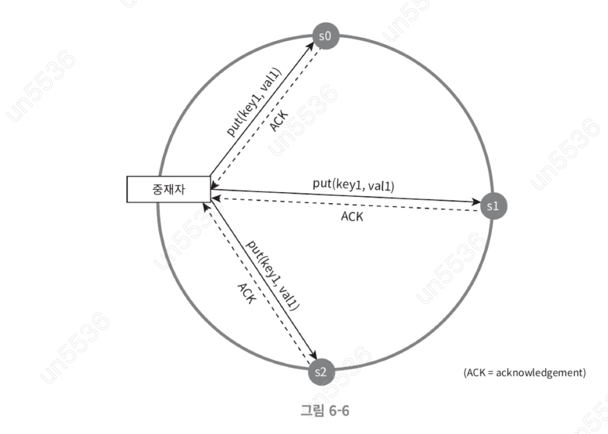

* 여러 노드에 다중화된 데이터는 적절히 동기화 되야 한다.
* 정족수 합의 프로토컬을 사용하면 읽기/쓰기 연산 모두에 일관성을 보장할 수 있다.
* N = 사본 개수
* W = 쓰기 연산에 대한 정족수. 쓰기 연산이 성관한 것으로 간주되려면 적어도 W개의 서버로부터 쓰기 연산이 성공했다는 응답을 받아야 한다.
* R = 읽기 연산에 대한 정족수. 쓰기 연산이 성공한 것으로 간주되려면 적어도 R개의 서버로부터 응답을 박아야 한다.
* R = 1, W = N: 빠른 읽기 연산에 최적화 된 시스템
* W = 1, R = N: 빠른 쓰기 연산에 최적화된 시스템
* W + R > N: 강한 일관성이 보장됨 (보통 N = 3, W = R = 2)
* W + R <= N: 강한 일관성이 보장되지 않음

#### 일관성 모델

* 강한 일관성: 모든 읽기 연산은 가장 최근에 갱신된 과를 반환한다. 즉 클라이언트는 절대로 낡은 데이터를 보지 못한다.
* 약한 일관성: 읽기 연산은 가장 최근에 갱신된 결과를 반환하지 못할 수 이싿.
* 최종 일관성: 약한 일관성의 형태로, 갱신 결과가 결국에는 모든 사본에 반영되는 모델

#### 비 일관성 해소 기법: 데이터 버저닝

* 데이터를 다중화하면 가용성은 높아지지만 사본 간 일관성이 꺠질 가능서은 높아진다.
* 버저닝과 벡터 시계는 그 문제를 해소하기 위한 기술이다.
* 버저닝은 데이터를 변경할 때마다 해당 데이터의 새로운 버전을 만드는 것을 의미한다. 따라서 각 버전의 데이터는 변경이 불가능하다.

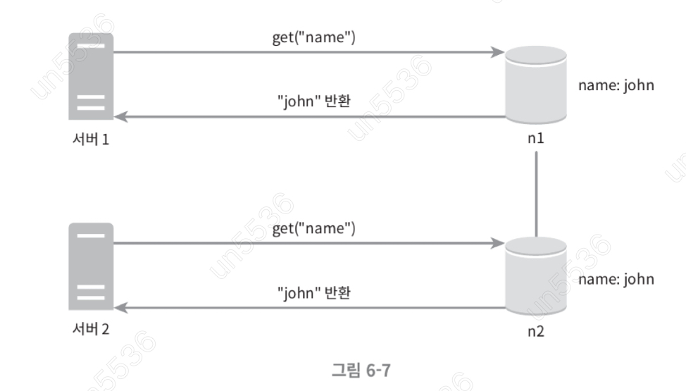

* 순차 수정

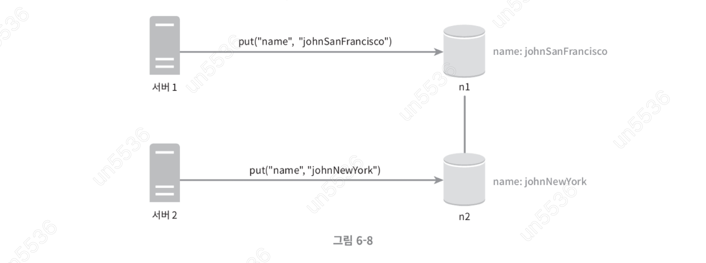

* 충돌 수정

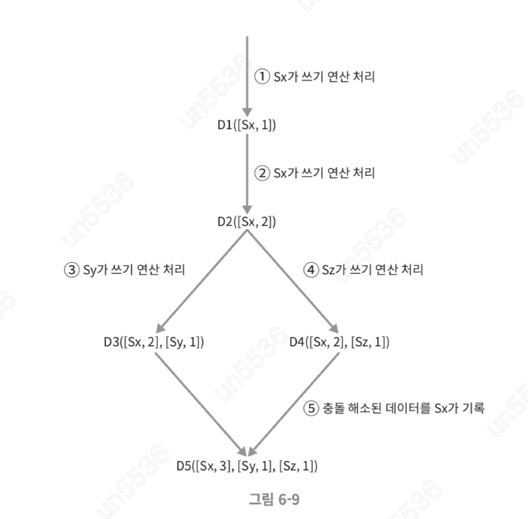

이 문제를 해결 하기 위해서 백터 시계가 존재

1. 클라이언트가 데이터 D1을 시스템에 기록
2. 다른 클라이언트가 데이터 D1을 읽고 D2를 업데이트한 다음 기록 한다. D2는 D1에 대한 변경이므로 D1을 넢어 쓴다.
3. 다른 클라리언트가 D2를 읽어 D3를 갱신한 다음 기록한다.
4. 또 다른 클라리언트가 D2를 읽어 D4를 갱신한 다음 기록한다.
5. 어떤 클라이언트가 D3, D4를 읽어으면 데이터 간 충돌이 있다는 것을 알 수 있다.

### 쓰기 경로

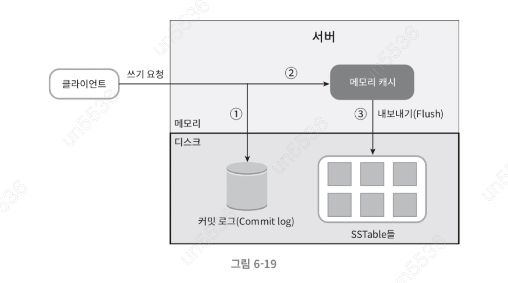

카산드라 쓰기 경로 케이스

1. 쓰기 요청이 커밋 로그 파일에 기록
2. 데이터가 메모리 캐시에 기록
3. 메모리 캐기사 가득차거나 사전에 정의된 어떤 임계치에 도달하면 데이터는 디스크에 있는 SSTable 파일에 기록된다. SSTable은 Sorted-String Table의 약자로, 정렬된 키-값 쌍을 저장하는 파일이다.

### 읽기 경로

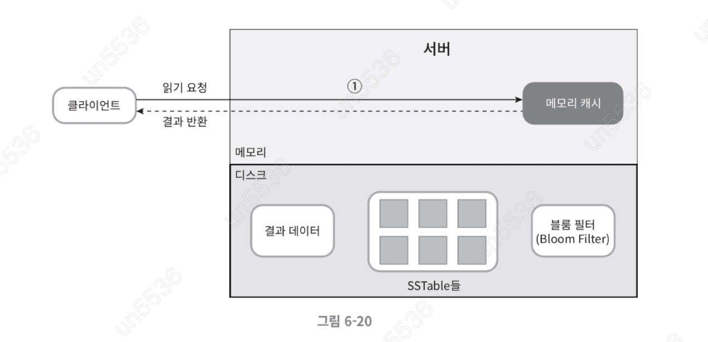

* 읽기 요청을 받으 노드는 데이터가 메모리 캐시에 있는지 부터 확인
* 데이터가 메모리에 있는 경우 결과 응답
* 데이터가 없다면 어느 SSTable에 찾는 키 있는 알아낼 방법 필요, 이런 문제를 블룸 필터가 사용

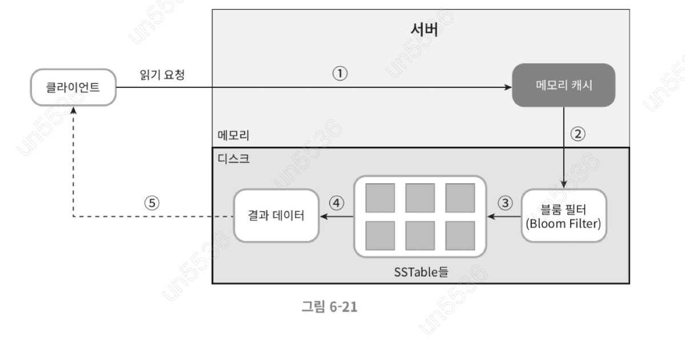

1. 데이터가 메모리에 있는지 검사한다 없으면 2로간다.
2. 데이터가 메모리에 없으므로 블룸 필터를 검사한다.
3. 블룸 필터를 통해 어떤 SSTable에 키가 보관되어 있는지 알아낸다
4. SSTable에서 데이터를 가져온다
5. 해당 데이터를 클라이언트에게 반환한다.

## 요약

| 목표/문제               | 기술                       |
|---------------------|--------------------------|
| 대규모 데이터 저장          | 안정 해시를 사용해 서버들에 부하 분산    |
| 읽기 연산에 대한 높은 가용성 보장 | 데이터를 여러 데이터센터에 다중화       |
| 쓰기 연산에 대한 높은 가용성 보장 | 버저닝 및 백터 시계를 사용한 충돌 해소   |
| 데이터 파티션             | 안정 해시                    |
| 점진적 규모 확장성          | 안정 해시                    |
| 다양성                 | 안정 해시                    |
| 조절 가능한 데이터 일관성      | 정족수 합의                   |
| 일시적 장애 처리           | 느슨한 정족수 프로토컬과 단서 후 임시 위탁 |
| 영구적 장애 처리           | 머클 트리                    |
| 데이터 센터 장애 대응        | 여러 데이터 센터에 걸친 데이터 다중화    |

